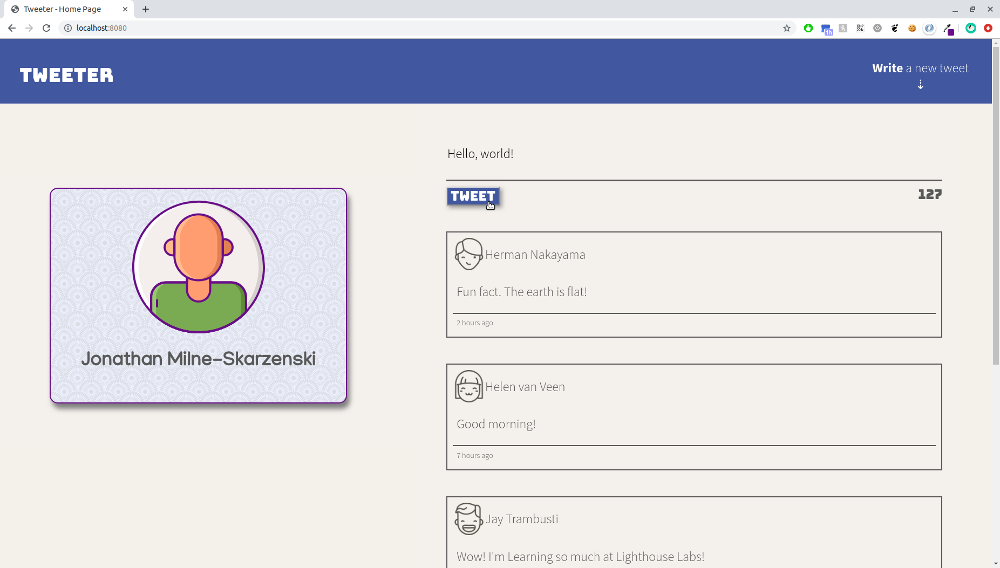
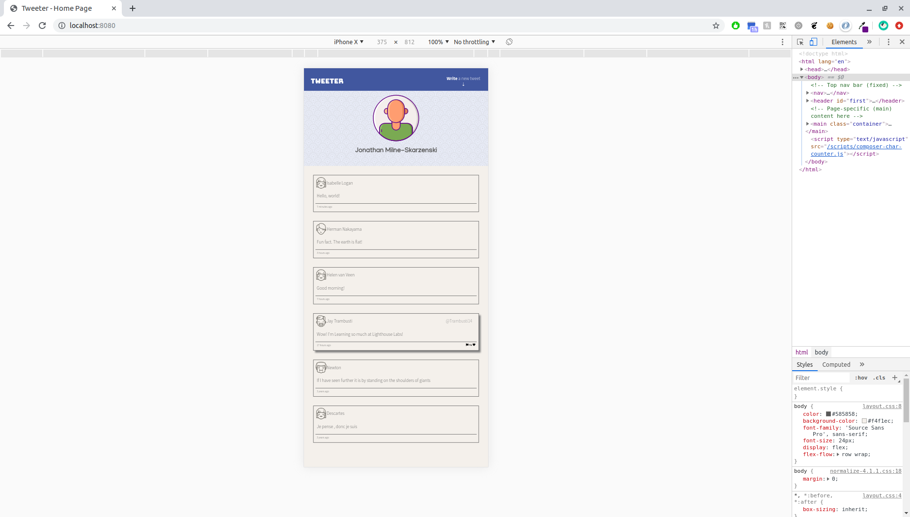

# Tweeter Project

Tweeter is a simple, single-page Twitter clone. 

This was an exercise in front-end, using HTML, CSS, JS, jQuery and AJAX. The objective was to get familiar with jQuery, using AJAX to handle our client-side requests to the server, and creating a mobile-first App with a responsive design.

Server-side was built using Node, Express and MongoDB, and was provided in order to drive our App and for us to focus on the client-side.

## Screenshots

## Getting Started

1. Fork this repository, then clone your fork of this repository.
2. Install dependencies using the `npm install` command.
3. Start the web server using the `npm run local` command. The app will be served at <http://localhost:8080/>.
4. Go to <http://localhost:8080/> in your browser.

## Dependencies

- Express
- Node 5.10.x or above
